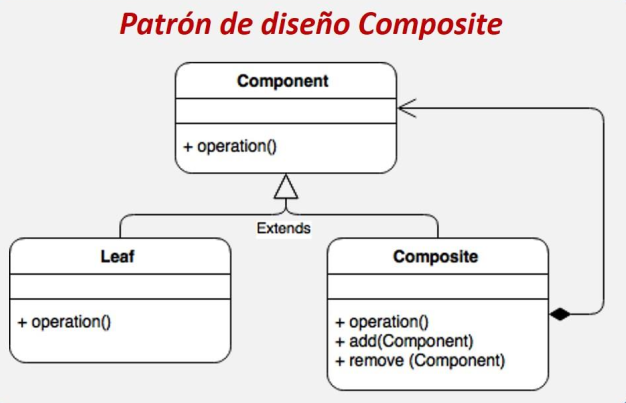

<table>
    <theader>
        <tr>
            <th></th>
            <th>
                UNIVERSIDAD LA SALLE 
                FACULTAD DE INGENIERÍAS 
                DEPARTAMENTO DE INGENIERÍA Y MATEMÁTICAS 
                CARRERA PROFESIONAL DE INGENIERÍA DE SOFTWARE
            </th>            
        </tr>
    </theader>
    
</table>

GUÍA DE LABORATORIO 

<table>
    <theader>
        <tr><th colspan="2">INFORMACIÓN BÁSICA</th></tr>
    </theader>
<tbody>

<tr><td>TÍTULO DE LA PRÁCTICA:</td><td>Patrón Composite</td></tr>
<tr><td colspan="2">RECURSOS:
    <ul>
    <li>Oscar J Blancarte Iturralde. Introducción a los patrones de diseño. Un enfoque práctico (Spanish Edition. CreateSpace Independent Publishing Platform (2016)</li>
    </ul>
</td>
</<tr>
<tr><td colspan="2">DOCENTES:
    <ul>
        <li>Richart Smith Escobedo Quispe  - r.escobedo@ulasalle.edu.pe</li>
    </ul>
</td>
</<tr>
</tdbody>
</table>

# Patrón Composite

[![License][license]][license-file]
[![Downloads][downloads]][releases]
[![Last Commit][last-commit]][releases]

[![Debian][Debian]][debian-site]
[![Git][Git]][git-site]
[![GitHub][GitHub]][github-site]
[![Vim][Vim]][vim-site]
[![Java][Java]][java-site]

#

## OBJETIVOS Y TEMAS

### OBJETIVOS
- Aprender el patrón Composite.

### TEMAS
-   El Patrón Composite
-   Estructura del patrón de diseño Composite.
-   Diagrama de secuencia del patrón Composite.
-   El Escenario.
-   La implementación.
-   La Ejecución.

## CONTENIDO DE LA GUÍA

### MARCO CONCEPTUAL

-   Patrón composite
    -   Si ud. quiere crear estructuras complejas a partir de estructuras simples. Este patrón puede ayudarlo.

-   Estructura del patrón de diseño Composite
    
    - Fuente: (Blancarte, O.) Introducción a los patrones de diseño.

## EJERCICIO RESUELTO

...

## EJERCICIOS PROPUESTOS

-   Se han creado estructuras complejas con objetos más pequeños.
    -   Agregue un nuevo atributo a la clase AbstractProduct para definir la tasa de impuesto que tendrá el producto, el impuesto deberá ser calculado y mostrado a nivel de paquete.
    -   Agregues otro atributo a la clase AbstractProduct para definir la cantidad, esta cantidad deberá ser calculada a la hora de mostrar el precio del paquete.
    -   Agregue productos para crear un paquete, podríamos agregar un producto de descuento con precio negativo.
-   Elabore los ejemplos y analice los resultados.

## REFERENCIAS
-   Oscar J Blancarte Iturralde. Introducción a los patrones de diseño_ Un enfoque práctico (Spanish Edition. CreateSpace Independent Publishing Platform (2016)

#

[license]: https://img.shields.io/github/license/rescobedoulasalle/git_github?label=rescobedoulasalle
[license-file]: https://github.com/rescobedoulasalle/git_github/blob/main/LICENSE

[downloads]: https://img.shields.io/github/downloads/rescobedoulasalle/git_github/total?label=Downloads
[releases]: https://github.com/rescobedoulasalle/git_github/releases/

[last-commit]: https://img.shields.io/github/last-commit/rescobedoulasalle/git_github?label=Last%20Commit

[Debian]: https://img.shields.io/badge/Debian-D70A53?style=for-the-badge&logo=debian&logoColor=white
[debian-site]: https://www.debian.org/index.es.html

[Git]: https://img.shields.io/badge/git-%23F05033.svg?style=for-the-badge&logo=git&logoColor=white
[git-site]: https://git-scm.com/

[GitHub]: https://img.shields.io/badge/github-%23121011.svg?style=for-the-badge&logo=github&logoColor=white
[github-site]: https://github.com/

[Vim]: https://img.shields.io/badge/VIM-%2311AB00.svg?style=for-the-badge&logo=vim&logoColor=white
[vim-site]: https://www.vim.org/

[Java]: https://img.shields.io/badge/java-%23ED8B00.svg?style=for-the-badge&logo=java&logoColor=white
[java-site]: https://docs.oracle.com/javase/tutorial/

[![Debian][Debian]][debian-site]
[![Git][Git]][git-site]
[![GitHub][GitHub]][github-site]
[![Vim][Vim]][vim-site]
[![Java][Java]][java-site]

[![License][license]][license-file]
[![Downloads][downloads]][releases]
[![Last Commit][last-commit]][releases]

